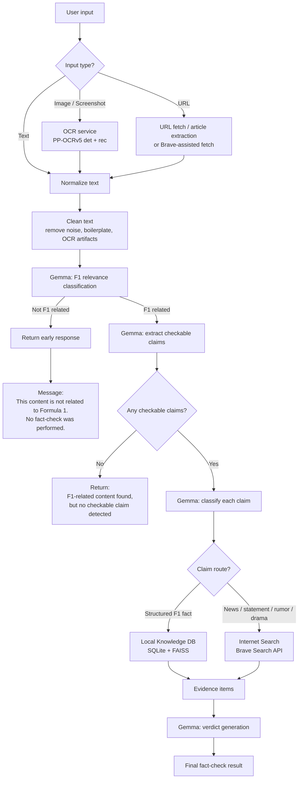

```mermaid
flowchart TD
    A["User input"] --> B{"Input type?"}

    B -->|Text| C["Normalize text"]
    B -->|Image / Screenshot| D["OCR service<br/>PP-OCRv5 det + rec"]
    B -->|URL| E["URL fetch / article extraction<br/>or Brave-assisted fetch"]

    D --> C
    E --> C

    C --> F["Clean text<br/>remove noise, boilerplate, OCR artifacts"]

    F --> G["Gemma: F1 relevance classification"]

    G -->|Not F1 related| H["Return early response"]
    H --> H1["Message:<br/>This content is not related to Formula 1.<br/>No fact-check was performed."]

    G -->|F1 related| I["Gemma: extract checkable claims"]

    I --> J{"Any checkable claims?"}

    J -->|No| K["Return:<br/>F1-related content found,<br/>but no checkable claim detected"]

    J -->|Yes| L["Gemma: classify each claim"]

    L --> M{"Claim route?"}

    M -->|Structured F1 fact| N["Local Knowledge DB<br/>SQLite + FAISS"]
    M -->|News / statement / rumor / drama| O["Internet Search<br/>Brave Search API"]

    N --> P["Evidence items"]
    O --> P

    P --> Q["Gemma: verdict generation"]
    Q --> R["Final fact-check result"]
```
