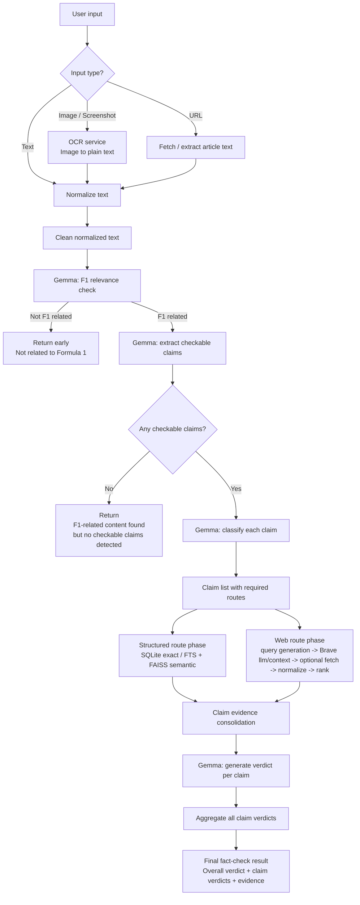

# F1 Fact Checker

Formula 1 fact-checking stack for Jetson Orin Nano Super.

The repository is organized around four runtime services:

- `ocr-service`: image-to-text extraction for screenshots
- `llm-service`: Gemma/llama-server wrapper for prompt-driven reasoning
- `fact-check-service`: claim extraction, routing, retrieval, and verdict generation
- `web-app`: user-facing UI, auth/session handling, and fact-check history

## Quick Start

1. Read the directory structure doc: [docs/project_directory_structure.md](docs/project_directory_structure.md)
2. Read the service docs for the blocks you care about:
   - [OCR service](docs/ocr_service.md)
   - [LLM service](docs/llm_service.md)
   - [Fact-check service](docs/fact_check_service.md)
   - [Web app](docs/web_app.md)
3. Check the current progress note: [docs/project_progress.md](docs/project_progress.md)

## Current Architecture

The current verification model extracts all checkable claims first, then executes
retrieval by route before consolidating evidence back into claim verdicts:

- structured factual claims use the local Formula 1 knowledge database with SQLite + FAISS-backed retrieval
- news / drama / statement claims use Brave `llm/context` grounding first, then optional article fetch, normalization, and ranking
- mixed claims require both structured and web routes

The current text flow is:
```text
input
↓
text normalization
↓
F1 relevance check
↓
claim extraction
↓
claim classification per claim
↓
claim execution planning
↓
structured route phase
↓
web route phase
↓
claim evidence consolidation
↓
claim-level verdict
↓
aggregate final result
```



`fact-check-service` exposes text, URL, and image endpoints. URL and image
inputs are normalized into clean text first, then all three paths reuse the same
F1 relevance gate, claim extraction, routing, retrieval, and verdict pipeline.

## Model Storage

Runtime model files live outside the repository under `/home/viettran_orin/models`.

- `configs/models.host.env` points local host runs to that model root
- `configs/models.container.env` points Docker services to the same mounted model root

## Secrets

Store deployment secrets in the project-root `.env`, not in committed config files. This includes:

- `WEB_APP_SECRET_KEY`
- SMTP credentials
- `BRAVE_SEARCH_API_KEY`

## Documentation Policy

Active documentation lives in `docs/` plus this root `README.md`. Legacy OCR-era docs are no longer part of the active documentation set.
