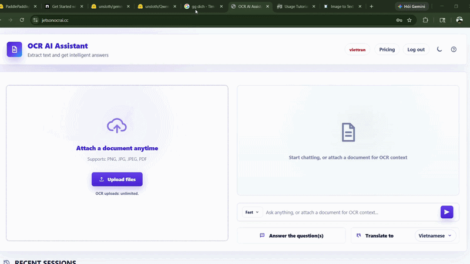
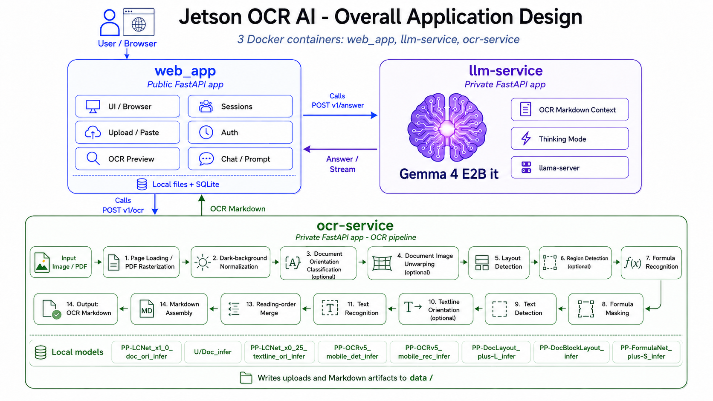

<h1 align="center">OCR AI Assistant</h1>

  <strong>Fast local OCR, quick question answering, and multilingual translation on Jetson Orin Nano Super.</strong>

  <a href="https://jetsonocrai.cc"><strong>jetsonocrai.cc</strong></a>

  

## Overview

OCR AI Assistant is a lightweight local OCR + LLM application built for fast document reading tasks. It extracts text from images and documents, helps answer short questions or multiple-choice quizzes, and translates OCR results across languages.

## Best For

- Screenshots, notes, exercises, and scanned pages.
- Short OCR tasks that need immediate answers.
- Translating extracted text between languages.
- Reading documents that mix normal text and formulas.

## Limitations

This project is optimized for quick and simple OCR workflows. Very large PDFs, dense academic papers, complex layouts, low-quality scans, or heavily formatted documents may require more processing time and can produce less accurate results.

## Architecture

  

The application is split into three main services:

- **web_app** — browser interface, upload flow, sessions, and API calls.
- **ocr-service** — OCR pipeline for text, layout, and formula extraction.
- **llm-service** — local LLM service for answers, translation, and prompt handling.

## Documentation

For system design, service details, and workspace layout, see [docs/](./docs/).

## Model Configuration

Runtime model files are stored outside the repo in `/home/viettran_orin/models`.

- `configs/models.host.env` points local host runs to that model root.
- `configs/models.container.env` points Docker services to the same model root mounted at `/models`.
